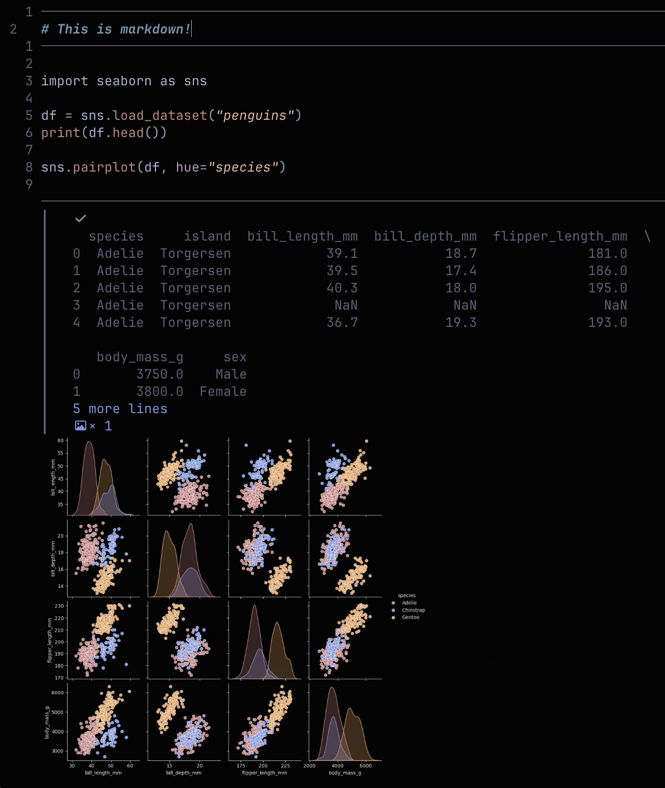

# notebook.nvim

Edit and run Python Jupyter Notebooks as single buffers.

Unlike conventional notebook interfaces, this plugin renders all cells in a single buffer, allowing you to edit and run
cells without having to 'open' cells. The approach is to dump everything into a single python file and use docstring
comments to represent markdown cells.
Cover that in a bunch of extmarks and you get a unique way of using Python Jupyter Notebooks.



Example usage for `lazy.nvim`.

```lua
return {
	"twhlynch/notebook.nvim"
	opts = {
		keybind_prefix = "<leader>c",
	},
}
```

<details><summary>Default Options and Keybinds</summary>

```lua
return {
	"twhlynch/notebook.nvim"
	opts = {
		keybind_prefix = "<leader>c",
		max_output_lines = 10,
		custom_plot_theme = true,
		custom_theme_colors = { '#4878CF', '#6ACC65', '#D65F5F', '#B47CC7', '#C4AD66', '#77BEDB' },
		cell_gap = 0,
		write_output = true,
		new_cell_cmd = "normal! A\nstartinsert!",
		image_warn_threshold = 10,

		keys = {
			run_cell           = "r",
			run_cells_all      = "a",
			run_cells_up       = "u",
			run_cells_down     = "d",

			next_cell          = "]c",
			previous_cell      = "[c",
			textobject_cell    = "ic",

			insert_markdown    = "m",
			insert_code        = "c",
			split_cell         = "s",
			remove_cell        = "X",

			clear_all_output   = "x",
			refresh_all_output = "R",

			open_image         = "gx",
			show_output        = "<CR>",
			dump_images        = "D",
		},

		hl = {
			output  = "NonText",
			error   = "DiagnosticError",
			hint    = "DiagnosticHint",
			success = "DiagnosticOk",
		},

		strings = {
			new_cell      = { "# " },
			new_code_cell = { "# " },

			output_border    = "┃   ",
			cell_border      = "─",
			cell_executed    = "[ ✓ Done ]",
			cell_running     = "[ Running... ]",
			truncated_output = "<Enter> %s more lines",
			image_output     = "<gx> %s × image",
		},
	},
}
```

</details>
